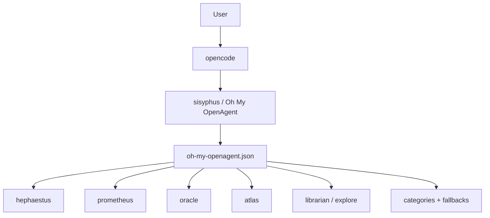

# Workflow Diagram

```mermaid
flowchart TD
    U[User] --> O[opencode]
    O --> S[sisyphus / Oh My OpenAgent]
    S --> CFG[oh-my-openagent.json]
    CFG --> H[hephaestus]
    CFG --> P[prometheus]
    CFG --> OR[oracle]
    CFG --> A[atlas]
    CFG --> L[librarian / explore]
    CFG --> C[categories + fallbacks]
```

OpenCode starts directly in `sisyphus`. There are no custom provider-specific or GO-local agents.
