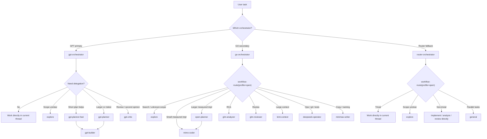

# Workflow Diagram



## Key Differences

- **gpt-orchestrator**: delegates to GPT subagents (`gpt-planner`, `gpt-builder`, `gpt-critic`)
- **go-orchestrator**: delegates to opencode-go subagents (`mimo-coder`, `glm-analyzer`, `deepseek-operator`, etc.)
- **router-orchestrator**: works directly without provider-specific subagents (fallback tier)

## Fallback Chain

```
GPT (primary) → GO (secondary) → Router (fallback)
```

When quota runs out on one provider, switch to the next orchestrator manually.
