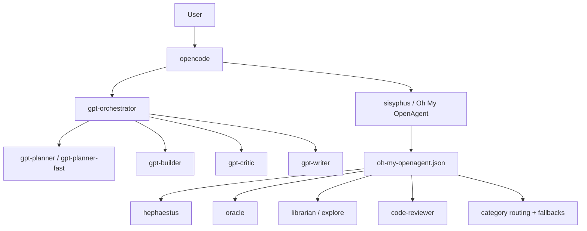

# Workflow Diagram

```mermaid
flowchart TD
    U[User] --> O[opencode]
    O --> G[gpt-orchestrator]
    O --> S[sisyphus / Oh My OpenAgent]

    G --> GP[gpt-planner / gpt-planner-fast]
    G --> GB[gpt-builder]
    G --> GC[gpt-critic]
    G --> GW[gpt-writer]

    S --> OMO[oh-my-openagent.json]
    OMO --> H[hephaestus]
    OMO --> OR[oracle]
    OMO --> L[librarian / explore]
    OMO --> CR[code-reviewer]
    OMO --> C[category routing + fallbacks]
```

- GPT uses the custom GPT agents in `agents/`.
- GO enters Oh My OpenAgent through `sisyphus`.
- There is no custom GO orchestrator/subagent tree.
