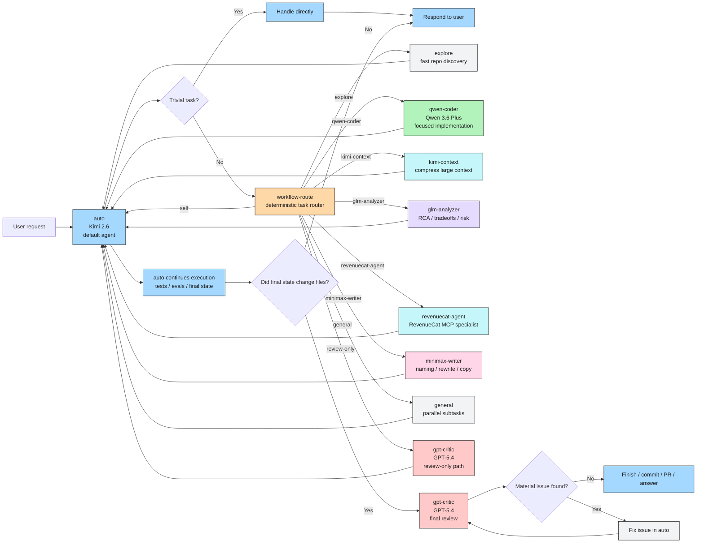

# OpenCode Workflow Diagram

Mermaid version of the workflow.

This is the canonical visual explanation of the setup.

## Main Diagram

## Reading Guide

- The user talks only to `auto`.
- `auto` handles simple work directly.
- `workflow-route` decides which specialist to call for non-trivial work.
- Specialists return control back to `auto`.
- If the final state changed files, `gpt-critic` reviews the completed result.
- If GPT finds a material issue, `auto` fixes it and runs the final review again.

## Core Message

Open models do almost all of the work.

GPT does the final review on completed changed work, not on every intermediate edit.
