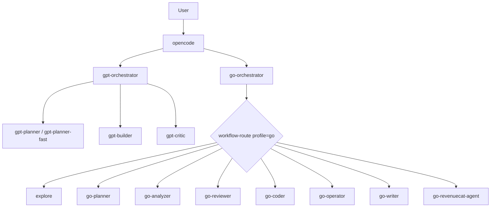

# Workflow Diagram

```mermaid
flowchart TD
    U[User] --> O[opencode]
    O --> G[gpt-orchestrator]
    O --> GO[go-orchestrator]

    G --> GP[gpt-planner / gpt-planner-fast]
    G --> GB[gpt-builder]
    G --> GC[gpt-critic]

    GO --> GR{workflow-route profile=go}
    GR --> GE[explore]
    GR --> GPL[go-planner]
    GR --> GA[go-analyzer]
    GR --> GV[go-reviewer]
    GR --> GCOD[go-coder]
    GR --> GOP[go-operator]
    GR --> GW[go-writer]
    GR --> GRC[go-revenuecat-agent]
```
