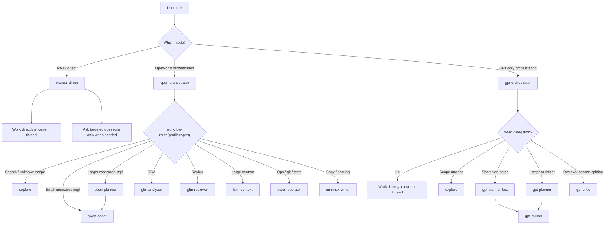

# Workflow Diagram

```mermaid
flowchart TD
    U["User task"] --> M{"Which mode?"}

    M -->|Raw / direct| D["manual-direct"]
    M -->|Open-only orchestration| O["open-orchestrator"]
    M -->|GPT-only orchestration| G["gpt-orchestrator"]

    D --> D1["Work directly in current thread"]
    D --> D2["Ask targeted questions only when needed"]

    O --> OR{"workflow-route(profile=open)"}
    OR -->|Search / unknown scope| OE["explore"]
    OR -->|Small measured impl| OM["qwen-coder"]
    OR -->|Larger measured impl| OP["open-planner"]
    OP --> OM
    OR -->|RCA| OA["glm-analyzer"]
    OR -->|Review| OV["glm-reviewer"]
    OR -->|Large context| OK["kimi-context"]
    OR -->|Ops / git / tests| OO["qwen-operator"]
    OR -->|Copy / naming| OW["minimax-writer"]

    G --> GR{"Need delegation?"}
    GR -->|No| GS["Work directly in current thread"]
    GR -->|Scope unclear| GE["explore"]
    GR -->|Short plan helps| GF["gpt-planner-fast"]
    GR -->|Larger or riskier| GP["gpt-planner"]
    GF --> GB["gpt-builder"]
    GP --> GB
    GR -->|Review / second opinion| GC["gpt-critic"]
```
