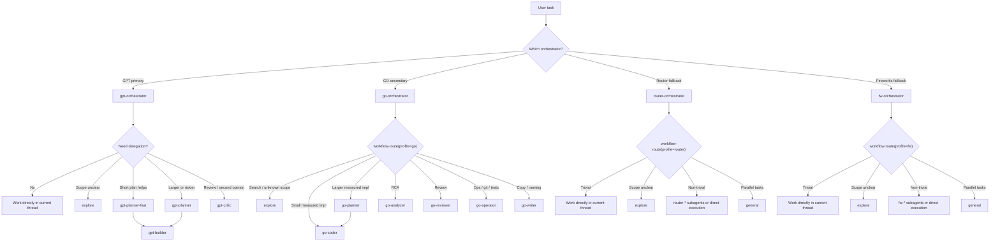

# Workflow Diagram



## Key Differences

- **gpt-orchestrator**: delegates only to GPT subagents (`gpt-planner`, `gpt-builder`, `gpt-critic`)
- **go-orchestrator**: delegates only to opencode-go subagents (`go-coder`, `go-analyzer`, `go-operator`, etc.)
- **router-orchestrator**: delegates only to OpenRouter subagents (`router-*`) when delegation helps
- **fw-orchestrator**: delegates only to Fireworks AI subagents (`fw-*`) when delegation helps

## Fallback Chain

```
GPT (primary) -> GO (secondary) -> Router / Fireworks (fallbacks)
```

Each provider boundary is strict. An orchestrator may only call subagents backed by the same provider.
